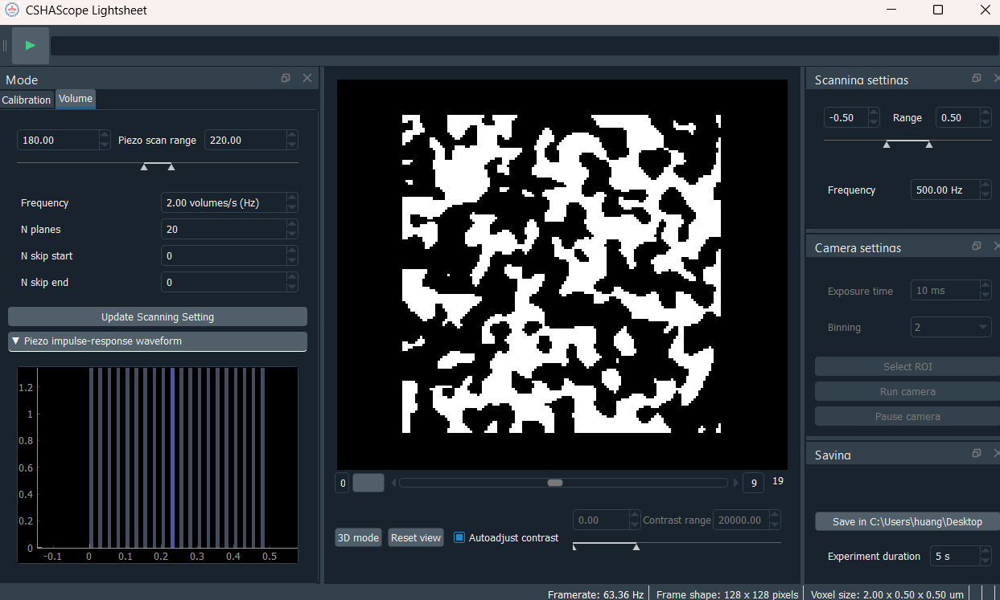
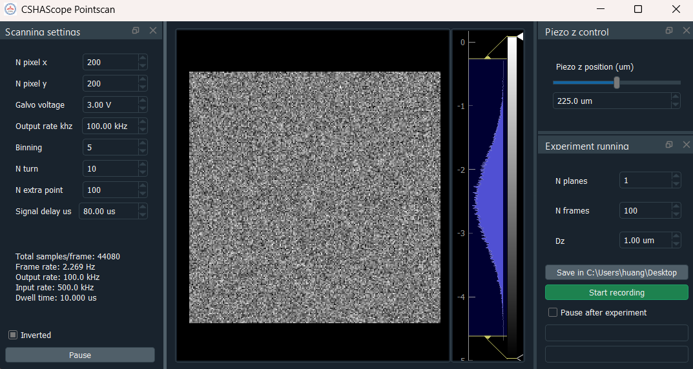

# cshascope


<strong>cshascope</strong> is the microscope control software used for the CSHA
Optic Rotation microscope. The software is built for the Optic Rotation module of the
[CSH Asia Neuroimaging Course](https://cshaneuroimaging.org/), where students
assemble and operate a custom microscope as part of a hands-on optical
neuroimaging curriculum.

<br clear="left">

## What This Repository Contains

The package currently provides two microscope-control modes:

- **Light-sheet mode** for volumetric light-sheet acquisition with NI DAQ output
  and Thorlabs camera acquisition.



- **Point-scan mode** for raster-style point scanning with explicit control over
  scan geometry and timing.



## Install

Create the conda environment and install the package:

```bash
conda env create -f environment.yml
conda activate cshascope
pip install .
```

For development:

```bash
pip install -e .
```

The light-sheet mode uses a Thorlabs scientific camera. Before running with real
camera hardware, install the Thorlabs Scientific Camera Python SDK separately
and make sure the SDK DLL directory matches the local configuration in
`~/.cshascope/hardware_config.toml`.

## Run

```bash
cshascope --lightsheet
cshascope --pointscan
```

## License and Provenance

This repository is distributed under the **GNU General Public License v3.0**.
See [LICENSE](LICENSE) for the full license text.

cshascope includes software derived from two microscope-control projects from
the Portugues Lab:

- **Point-scan mode** is adapted from
  [portugueslab/brunoise](https://github.com/portugueslab/brunoise).
- **Light-sheet mode** is adapted from
  [portugueslab/sashimi](https://github.com/portugueslab/sashimi).

Major changes made for cshascope include:

For the light-sheet mode:

- Adapted the hardware setting for the course microscope.
- Added a hardware interface for Thorlabs scientific cameras.
- Moved camera control into its own state machine.
- Changed Volume-mode AI/AO handling from real-time read/write to
  precomputed cyclic playback to reduce resource usage.

For the point-scan mode:

- Added a piezo control module.
- Replaced externally triggered startup with self-starting acquisition.
- Changed the computational logic of scanning parameters to match teaching demands.
